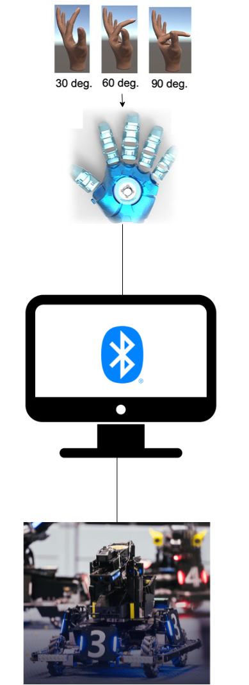
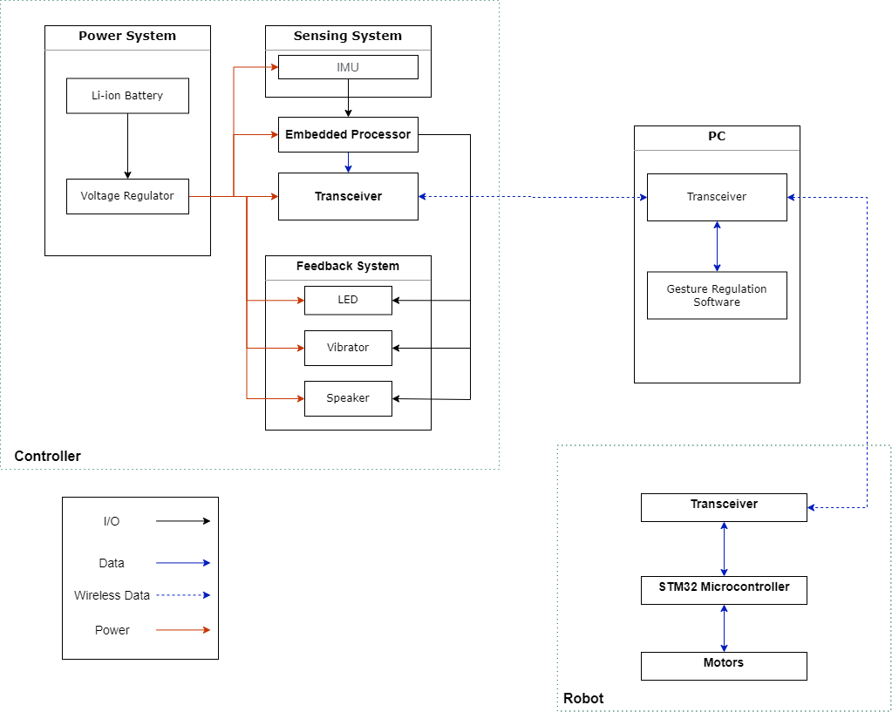

# Design Document

## 1. Introduction

### Problem and Solution Overview

Traditionally, different robots are controlled by their specialized controller from different companies, and it takes time to learn how to smoothly and naturally use them. We propose a gesture control system that builds upon the system, making the process of controlling a robot simple and fun. We plan to design a robot controller which can recognize human gestures and send corresponding commands to robots. The system will have three high-level requirements.

## 2. Visual Aid

## 3. High-level requirements list

The first one is that the controller mounted on the user would be able to read the sensors placed on the body of the user and calculate the position of different body parts of the user and broadcast through Bluetooth.

The second one is that it would enable the gestures and movements of the user to be translated to actual robot controlling actions through a software running on a powerful device (like PC) after receiving data using Bluetooth, and it would also have the capability of commanding the robot using another Bluetooth link.

The third one is that it would be able to transmit the warnings of robots to signals that can be sensed by humans through actuators placed on the user, like lights (LEDs), vibration motors, and buzzers.

## 4. Block Diagram

## 5. Requirements & Verification Tables

Requirements

1. Provide 5V from a 3.7V +- 0.2V source
2. Maintain the temperature of the system is below 40 degrees celsius.
3. Make sure the IMU data are reasonable and when transferring to robot control, no hazard would occur.
4. Bluetooth function normally with no communication error.

Verification:

1. Using an oscilloscope or multimeter to measure the voltage input, make sure the voltage is above 4.5V for the IIC line to work correctly.
2. Using external infrared sensors together with a thermometer on board to measure the temperature, make sure that the device can activate it's kill switch when overheat.
3. Rotate each IMUs simultaneously and see if a combination of the IMU readings will cause hazards (e.g. robot moving over-speed, crashing into obstacles hard).
4. Run the transmitter and receiver with both wireless (bluetooth) link on, and also a physical wire. Using the embedded processor to verify that the received data is the same under various conditions (e.g. magnetic interference).

## 7. Circuit Schematics

## 8. Tolerance Analysis

The IMUs will be measuring the magnetic field strength to calculate the angle of the unit. However, if the IMU is placed near a powerful external magnetic field source other than the earth (e.g. motors, large block of conductive metal, wall power cable/outlet), then the reading might be affected and produce garbage result. We will be examining the reasonable tolerance of data error and the real motion range of human finger.

According to the specification of then IMU that we are currently using, WT901, when operating with the magnetometer active, external metals should be placed about 30cm away from the IMU, and other devices creating strong magnetic field (e.g. motor, power outlets) should be placed about 50cm away from the IMUs.

## 9. Ethical and Safety Issues

User Safety

1. Since our product will directly contact human skin, it is important to separate the skin from electricity and make sure that no hazardous components will put users in danger. The wearable component in our design does not pose a threat to the user, and we will keep it operating under a low-voltage that reduces energy consumption.

2. When power is low, the product should notify the user and shut down the system automatically to prevent the battery from starvation. If the system is not in use for a long time, it should also shut down by itself. Our product utilizes Bluetooth protocol for wireless communication between the controller and the robot. We commit to protect and respect user privacy, complying with section 7.8.I-1 of IEEE’s guidelines.

Build Safety

1. Always power off the battery before any hardware changes. Rubber gloves are required before touching any electric components. We will treat all persons fairly and with respect, and to not engage in discrimination based on characteristics such as race, religion, gender, disability, age, national origin, sexual orientation, gender identity, or gender expression. We will also not engage in harassment of any form, including sexual harassment or bullying behavior.

## 10. Citations

[1] “IEEE code of Ethics,” IEEE. [Online]. Available: <https://www.ieee.org/about/corporate/governance/p7-8.html>. [Accessed: 21-Feb-2022].

[2] M. Zhu, Z. Sun, Z. Zhang, Q. Shi, T. He, H. Liu, T. Chen, and C. Lee, “Haptic-feedback smart glove as a creative human-machine interface (HMI) for virtual/augmented reality applications,” Science Advances, vol. 6, no. 19, 2020.
