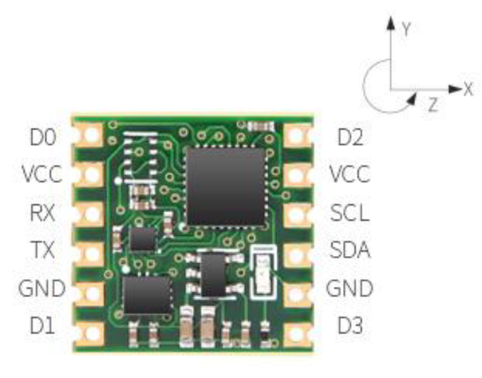
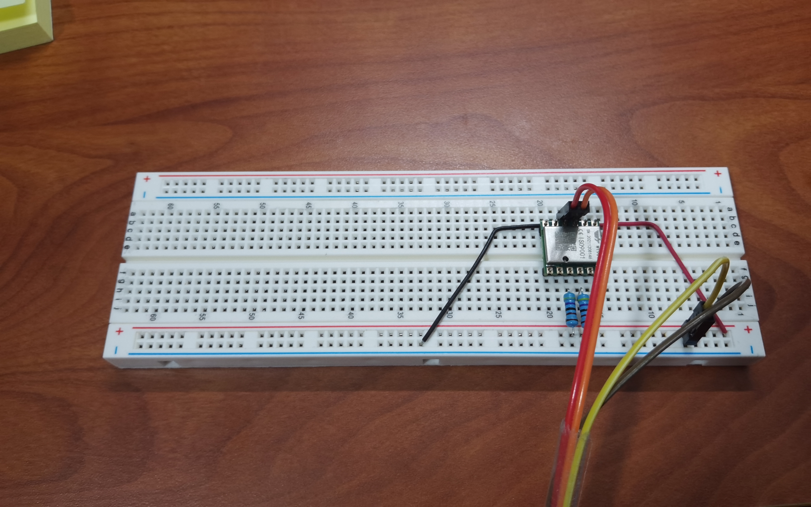
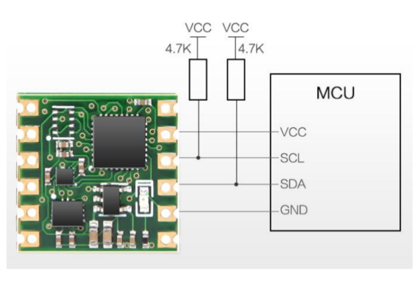
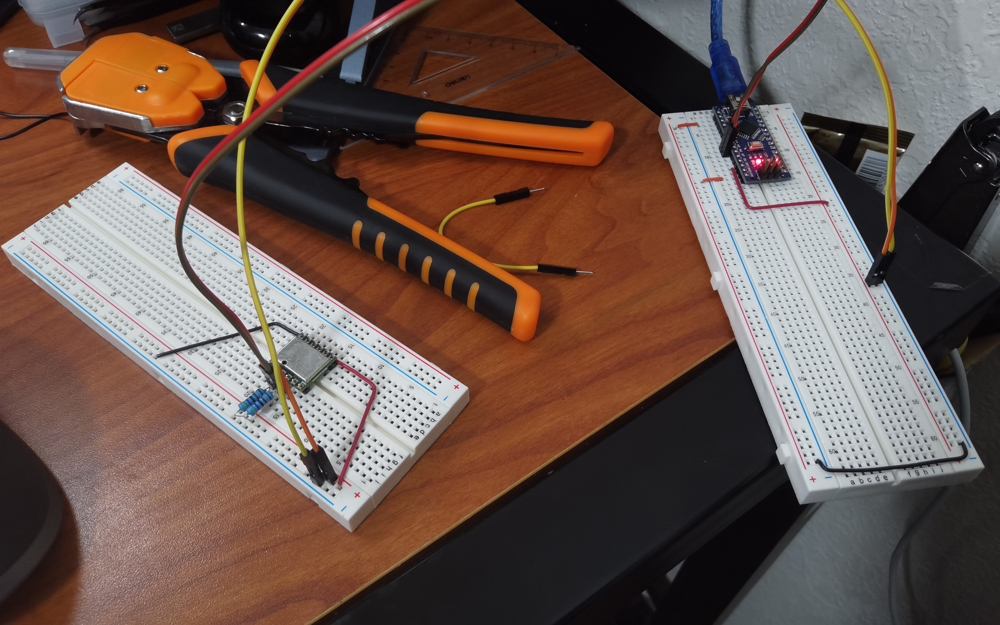

# Eric Worklog

## Table of Contents

1. [Week 2022-02-07 Finding parts](#2022-02-07-finding-parts)
2. [Week 2022-02-14 Testing Wit-Motion WT901](#2022-02-14-testing-wit-motion-wt901)

## 2022-02-07 Finding Parts

Finding available IMUs

- [Wit-Motion (9-Axis Accelerometer + Tilt Sensor)](https://www.amazon.com/Accelerometer-Acceleration-Gyroscope-Electronic-Magnetometer/dp/B07GBRTB5K?ref_=ast_sto_dp) <- prefer this one
- [Adafruit (9-Axis Accelerometer)](https://www.amazon.com/Adafruit-Absolute-Orientation-Fusion-Breakout/dp/B017PEIGIG/ref=asc_df_B017PEIGIG/?tag=hyprod-20&linkCode=df0&hvadid=312142335725&hvpos=&hvnetw=g&hvrand=10955145127703543807&hvpone=&hvptwo=&hvqmt=&hvdev=c&hvdvcmdl=&hvlocint=&hvlocphy=9022196&hvtargid=pla-442396583748&psc=1)

Finding available STM32 processor

- [STM32F427VGT6](https://www.aliexpress.com/item/1005003731146258.html?spm=a2g0o.productlist.0.0.6f1e5287woZzTa&algo_pvid=ef53fac1-0262-4ef9-8786-5a33670db49b&aem_p4p_detail=2022020920080515995579616864100133835795&algo_exp_id=ef53fac1-0262-4ef9-8786-5a33670db49b-1&pdp_ext_f=%7B%22sku_id%22%3A%2212000026964346600%22%7D&pdp_pi=-1%3B21.0%3B-1%3B-1%40salePrice%3BUSD%3Bsearch-mainSearch) <- STM32F427 chip that have relatively short delivery time (about 2 weeks)

Questions to ask:

- Who will be in charge of soldering bc these CPUs are fragile
- Who will be paying for these components bc they will be expensive

## 2022-02-14 Testing Wit-Motion WT901

- [WT901 Manual](https://github.com/WITMOTION/WT901/blob/master/WT901%20Manual.pdf)
- [WT901 DataSheet](https://github.com/WITMOTION/WT901/blob/master/WT901%20Datasheet.pdf)

The chip have following configuration 

**Notice:** The chip uses 5V input voltage, using 3.3V as source voltage might cause IIC communication failure.

The chip uses the `RX` and `TX` pins to communicate with outside with UART protocol. Reading from the sensor through UART is now possible using a naive `uart_read.py` script. Although the IMU have other data to read, now only attempting to read Euler angles and quaternions only.

Testing image 

The chip can also use the `SCL` and `SDA` pins to communicate with outside with IIC protocol.IIC communication is also possible, but the script depends on Arduino right now since it is hard to find and use USB to IIC devices.

**Notice:** Pull-up resistors are needed on `SCL` and `SDA` pins as the documentation specifies because IIC pins are open-drain. 

Testing image 

In testing, a Arduino Nano acts like a bridge between computer and WT901 chip.

- A less powerful embedded processor may be used other than STM32F427 at initial thought, the processing of data is not to heavy, even Arduino Nano can handle a few.
- The processor should have ability to communicate through IIC (for WT901), PWM (for vibration motor and LED), and UART (for communicating with bluetooth chip).
