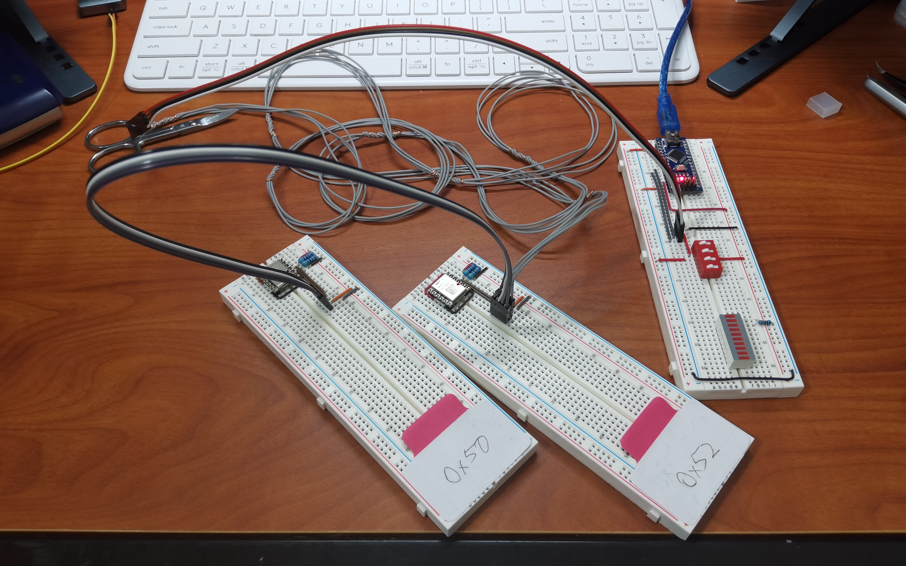
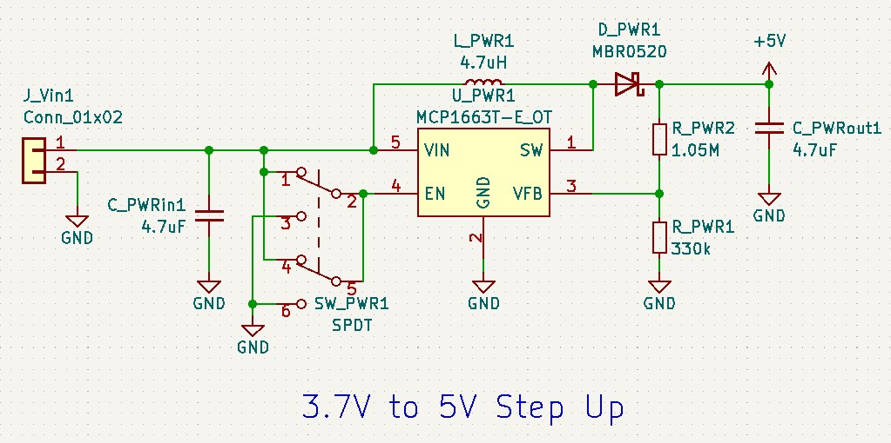
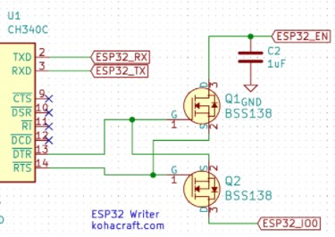
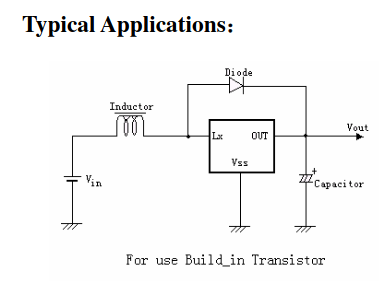

# Eric Worklog

## Table of Contents

1. [Week 2022-02-07 Finding parts](#2022-02-07-finding-parts)
2. [Week 2022-02-14 Testing Wit-Motion WT901](#2022-02-14-testing-wit-motion-wt901)
3. [Week 2022-03-07 Designing PCB](#2022-03-07-designing-pcb)
4. [Week 2022-03-21 Soldering and Redesigning PCB](#2022-03-21-soldering-and-redesigning-pcb)

## Important Notes

1. [WT901 Manual & Data Sheet](#wt901-manual-and-data-sheet)
2. [WT901 Pinout](#wt901-pinout)
3. [WT901 IIC](#wt901-iic)
4. [Quaternion to Euler](#conversion-from-quaternion-to-euler-angle)
5. [WT901 Operation Environment](#wt901-operation-environment)
6. [3.7V to 5V Step-up Circuit](#37v-to-5v-step-up-circuit)
7. [MCP1663 Datasheet](#mcp1663-datasheet)
8. [ESP32 Download Mode and Auto-program Circuit](#esp32-download-mode-and-auto-program-circuit)
9. [Image to Binary Image Converter](#image-to-binary-image-converter)

## 2022-02-07 Finding Parts

([Back to top](#eric-worklog))

Finding available IMUs

- [Wit-Motion (9-Axis Accelerometer + Tilt Sensor)](https://www.amazon.com/Accelerometer-Acceleration-Gyroscope-Electronic-Magnetometer/dp/B07GBRTB5K?ref_=ast_sto_dp) <- prefer this one
- [Adafruit (9-Axis Accelerometer)](https://www.amazon.com/Adafruit-Absolute-Orientation-Fusion-Breakout/dp/B017PEIGIG/ref=asc_df_B017PEIGIG/?tag=hyprod-20&linkCode=df0&hvadid=312142335725&hvpos=&hvnetw=g&hvrand=10955145127703543807&hvpone=&hvptwo=&hvqmt=&hvdev=c&hvdvcmdl=&hvlocint=&hvlocphy=9022196&hvtargid=pla-442396583748&psc=1)

Finding available STM32 processor

- [STM32F427VGT6](https://www.aliexpress.com/item/1005003731146258.html?spm=a2g0o.productlist.0.0.6f1e5287woZzTa&algo_pvid=ef53fac1-0262-4ef9-8786-5a33670db49b&aem_p4p_detail=2022020920080515995579616864100133835795&algo_exp_id=ef53fac1-0262-4ef9-8786-5a33670db49b-1&pdp_ext_f=%7B%22sku_id%22%3A%2212000026964346600%22%7D&pdp_pi=-1%3B21.0%3B-1%3B-1%40salePrice%3BUSD%3Bsearch-mainSearch) <- STM32F427 chip that have relatively short delivery time (about 2 weeks)

Questions to ask:

- Who will be in charge of soldering bc these CPUs are fragile
- Who will be paying for these components bc they will be expensive

## 2022-02-14 Testing Wit-Motion WT901

([Back to top](#eric-worklog))

### WT901 Manual and Data Sheet

- [WT901 Manual](https://github.com/WITMOTION/WT901/blob/master/WT901%20Manual.pdf)
- [WT901 DataSheet](https://github.com/WITMOTION/WT901/blob/master/WT901%20Datasheet.pdf)

### WT901 Pinout

**Notice:** The chip uses 5V input voltage, using 3.3V as source voltage might cause IIC communication failure.

The chip uses the `RX` and `TX` pins to communicate with outside with UART protocol. Reading from the sensor through UART is now possible using a naive `uart_read.py` script. Although the IMU have other data to read, now only attempting to read Euler angles and quaternions only.

Testing image

The chip can also use the `SCL` and `SDA` pins to communicate with outside with IIC protocol. IIC communication is possible, but the script depends on Arduino right now since it is hard to find and use USB to IIC devices.

### WT901 IIC

**Notice:** Pull-up resistors are needed on `SCL` and `SDA` pins as the documentation specifies because IIC pins are open-drain.

Testing image

In testing, a Arduino Nano acts like a bridge between computer and WT901 chip.

Thoughts about choosing embedded processor

- A less powerful embedded processor may be used other than STM32F427 at initial thought, the processing of data is not too heavy, even Arduino Nano can handle a few.
- The processor should have ability to communicate through IIC (for WT901), PWM (for vibration motor and LED), and UART (for communicating with bluetooth chip).

### Conversion from quaternion to Euler angle

Source [Wikipedia](https://en.wikipedia.org/wiki/Conversion_between_quaternions_and_Euler_angles#:~:text=cy%3B%0A%0A%20%20%20%20return%20q%3B%0A%7D-,Quaternion%20to%20Euler%20angles%20conversion,-%5Bedit%5D)

    // All angles in radian
    float roll = atan2(2 * (q0 * q1 + q2 * q3), 1 - 2 * (pow(q1, 2) + pow(q2, 2)));
    float pitch = asin(2 * (q0 * q2 - q3 * q1));
    float yaw = atan2(2 * (q0 * q3 + q1 * q2), 1 - 2 * (pow(q2, 2) + pow(q3, 2)));

### Using IIC to communicate with two WT901s

Use two WT901s connected to IIC interface through a extremely long 4-wire ([V+, GND, SDA, SCL]) to test the chip feedback data. This is done to simulated the scenario where the IMUs are mounted on human body.

One of the chips has IIC device address `0x50`, while the other one have IIC device address `0x52` as labeled in the testing diagram.

Testing image

The two devices can respond to IIC inquiries, and they return meaningful data. Testing code is modified to suit usage of multiple chips.

### WT901 Operation Environment

- The chips should be placed away from any magnetic field source (except for Earth's magnetic field of course...). For the magnetometers to stay functional.

  - It should be at least 30cm away from any soft-iron.
  - It should be at least 50cm away from motors.
  - To be added...

## 2022-03-07 Designing PCB

### Type of embedded CPU used

There are two possibilities proposed. First one is use ATMega328P-PU as the main processor, and the other one is using ESP32-WROOM-32D as the main processor. The advantages (+) and disadvantages (-) are listed below for these two processors.

ATMega328P-PU V.S. ESP32-WROOM-32D

- \+ Simple and easier to design a PCB board around. We decided to use a 28DIP package CPU for the ATMega328, since it will be easier when it comes to both designing and soldering the PCB, and it enables us to take the chip out when in situation needed (e.g. flash bootloader, unit testing hardware, etc.)
- \+ Team members are more familiar with this because we have used Arduino boards before. ATMega328P is the exact chip that are used on Arduino UNO and Arduino Nano.
- \- Have less capability of handling calculations, the CPU clock frequency of the ATMega328P is 16MHz (one of the datasheet I found says 20MHz). But it does not matter since the ESP32 can be running at a maximum frequency of 240MHz.
- \- Have less flash size. ATMega328 CPUs usually have a internal flash of 32KB, while the
ESP32 modules have 512KB. This is a huge difference, as when I was writing the test program for driving the SSD1306 OLED display, the driver code will take about 16KB of flash memory, about half of the available space on a ATMega328.
- \- ESP32 chips have built-in WIFI and Bluetooth capability. If an ATMega328 CPU is used, external Bluetooth transceiver will be used either through UART or SPI, which will decrease the efficiency of the system.

The final decision is that I will design two different PCBs, one for the ATMega328, and another one for the ESP32.

Due to the limited internal flash memory available for ATMega328 chips, two processors are required. One is for querying the IMUs and sending out data, and the other one is in charge of running the OLED, buttons, and actuators that belongs to the feedback system. The two chips will communicate through the SPI interface, because there is no other available interfaces on ATMega328 can be used to deliver messages efficiently.

The design that uses ESP32 chip also use two ESP32 modules. It is influenced by the ATMega328 design, the two chips will still divide the jobs into two parts and each one of the processor do its job. However in this case, the two modules are more powerful, and no external Bluetooth modules are needed because both of them have the ability of communication via wireless link using internal hardwares. The communication between the two chips will be using UART instead of SPI for communication since the duplex communication is generally easier when implemented using UART compared to SPI.

### Power system

The power system of two designs of the chips are basically the same, despite the fact that the ATMega328P chips need an input voltage of 5V while the ESP32-WROOM-32D modules only need 3.3V as input voltage. It is because we are trying to use a USB-to-UART chip that operates on 5V input voltage. The name of the chip series is `FT232`, and we want `FT232RL` in particular since that is easier to be soldered onto the PCB surface.

The power system have to step-up and regulate the input voltage of the Li-ion battery (about 3.7V $\pm$ 0.3V) to 5V, then supply the FT232RL chip with 5V. So far the designs are the same for both parts. The chip I choose here have the name `MCP1663`.

The next part is supplying voltage to embedded CPUs. With ATmega328, we can directly supply the 5V directly, but for ESP32, we have several choices.

- Because the FT232 chip have a output pin that supplies 3.3V, we can directly power the ESP32 modules using this pin. However, ESP32 chips are known to be hungry in power, and our application will need it to use it full capability, which the FT232 might not have the ability to handle that current.
- Step down the 5V voltage we have stepped up from the Li-ion battery to 3.3V to power the system.
- Build another regulator that connect to the Li-ion battery directly, step-down and regulate the voltage to 3.3V

I choose the second one for now, but it might subject to change during the development stage.

The system is subject to change after we can get the actual chips and able to test them. The USB-to-UART system might be changed if that is too complex to be figured out.

### 3.7V to 5V Step-up Circuit

Output to the MCP1663 chip is $\rm V_{FB}$, under proper configuration, the port will deliver a voltage of minimum: 1.190V, typical: 1.227V, maximum: 1.264V, which will then pass through a inverse voltage divider to boost up the voltage to around $1.227V * \frac{1.05M\Omega + 330k\Omega}{330\Omega} \approx 5.131V$, which will be then used to power he whole circuit.

MCP1663 provides a EN port to control the on/off of the device, a SPDT is attached to the port to select the working condition of the chip.

**WARNING**: The circuit design is based on MCP1640 originally, but that chip is out of stock in the whole America. MCP1663 is a replacement, but it is not specialized in converting 3.3V to 5V, rather 3.3V to 12V. The circuit is adapted to suit the current usage, but might not work as expected.

### MCP1663 Datasheet

[MCP1663 Datasheet](https://ww1.microchip.com/downloads/en/DeviceDoc/20005406A.pdf)

### Notes on the PCB Design

- The two boards have the same design on programming and debugging of the chips. The programming UART lines of both of the processor is connected to the FT232 chip with switches in between to choose which chip to program. Although this gives the ability to program two chips through only one USB-to-UART bridge, the debug messages that are printed out by the two chips cannot make it to the monitor on the computer together.

### Final Schematic of First Version PCB - ATMega328

### Final Layout of First Version PCB - ATMega328

### Final Schematic of First Version PCB - ESP32

### Final Layout of First Version PCB - ESP32

### ESP32 Download Mode and Auto-program Circuit

ESP32 have a native mode for the controller to be in a "download" mode, in which it receives subsequent bytes sent out to the controller the data to a file, then it will write 
First pressing the `IO0` button, then press the `EN` button without releasing the `IO` button, then subsequently releasing `EN` and `IO0` button. This will drop you into download mode, and for a micropython firmware, ESP32 module should print to the command line as follows:

    rst:0x1 (POWERON_RESET),boot:0x7 (DOWNLOAD_BOOT(UART0/UART1/SDIO_REI_REO_V2))
    waiting for download

However, this method involves manually pressing the buttons on the board, making the process lengthy and repetitive, so auto program circuit is there to help users avoid this repetitive process.

ESP32 development boards often have a circuit consists of two BJT or MOSFET transistors and several resistors which is named "auto-program circuit". It is done using two outputs from the USB-to-UART chip, `DTR` and `RTS`.

`DTR` stands for "Data Terminal Ready" and `RTS` stands for "Request to Send". For ESP32 to be auto-programed, the `DTR` is set to 1 first, then `RTS` will be set to 1, followed by an immediate set back to 0, then `DTR` also set back to zero. Also, for the circuit to receive a reset command from the chip, the RST can be brought down to zero individually.

So overall, for doing this automatically, a circuit need to be constructed with a truth table as follows.

| DTR | RTS | RST | IO0 |
| --- | --- | --- | --- |
|  1  |  1  |  1  |  1  |
|  0  |  0  |  1  |  1  |
|  1  |  0  |  0  |  1  |
|  0  |  1  |  1  |  0  |

(Notice that in the ESP32 module, the `RST` and `IO0` are active high signals)

The ESP32 development boards on the market right now are using UART-to-USB chips such as CP2102 or CH340. However, those two chips are not suitable for our design. As CP2102 does not provide a IC with easy-to-solder package, and CH340 is not available anywhere on the market. So we have to use a FT232RL for the propose. There is another problem with the FR232RL, is that the output pins `DTR` and `RTS` are inverted, while all the reference design I can find online are with CP2102, which have its `DTR` and `RTS` pins not inverted. Finally after a deep search on how to use FT232 for this propose, I came across this post, which is a design for CH340 chips. [Reference to a CH340 design](https://electronics.stackexchange.com/questions/448187/esp32-with-ftdi-programmer). Similar to FT232RL, CH340 also have its `DTR` and `RTS` pins inverted, making it the perfect reference design for a auto-program circuit with FT232.

### Image to Binary Image Converter

Useful when trying to create custom logos that would be displayed on the SSD1306.
[Image to binary image converter](https://www.dcode.fr/binary-image?__r=1.f155588443de719d03c97616d360cfb7)

## 2022-03-21 Soldering and Redesigning PCB

### Soldering

We decide to solder the PCB with ESP32 first, as when I was developing the firmware for the OLED display, I found out that even the simplest the driver will take up to 80% of the flash memory of the ATMega328 chip, but since the ESP32 modules have a far larger (512kB compares to 32kB) flash memory, there will be plenty flash space left for other possible code.

We spent about 10-12 hours on our first PCB, the hardest part is to use hot air gun to mount FT232RL chip onto the surface, as the spacing between the legs of the chip is small comparing to other components.

After soldering is complete, 

### System Verification

These systems works correctly on the first version PCB

- USB-to-UART bridge. When micro-USB cable is attached to the board, running command `lsusb` on a linux machine will show a device called "FDTI FT232 USB to UART bridge". This indicates that the chip is correctly connected to USB port.
- ESP32 module. After attaching micro-ISB cable, I am able to flush the MicroPython firmware onto the board, and triggering its REPL. The later test interactions with the REPL shows that the firmware are correctly downloaded and the module can execute MicroPython command with no difference than a development board.
- Basic I/O, including buttons, vibration motors, and buzzer. These devices that attached on the GPIO ports of the ESP32 module can respond to corresponding commands issued to the ESP32.
- Display. The two reserved ports for the display are running correctly both when one of the display is connected, and when both of them are connected.
- Local UART communication. The connection that utilizes the GPIO 17 and 18 for the purpose of RX and TX line of UART communication respectively. Messages can be sent in between the two controllers with negligible delay correctly.
- Auto-program circuit. The circuit can respond to the commands that the Arduino and other programming software sends and entering corresponding mode correctly.
- External Bluetooth communication. After the code for initiating and operating of the Bluetooth is deployed on the ESP32 modules, the bluetooth can send and receive messages just like a wireless UART connection.

These systems fails on the first version PCB

- Power system. After soldering complete and I try to power the module through digital power supply, when the voltage reaches 3.7V, which is normally the Li-ion battery operating voltage, the power system chip, specifically the `MCP1663`, starts to smoke.

### Why Redesigning PCB

There are several reasons for redesigning the PCB.

- Power system failure. The power system cannot provide any power to the system, and instead, it smokes and burns. This indicate that the system need a completely new design, probably with another chip that have large commercial use as there will be more schematics and designs for us to reference to.
- Bad mounting method for buzzer and vibration motor. Now the two devices are not surface mounted, they are connected through JST-XH connectors. This make them hang in the air, and thus easily broke during the operating process.
- Switches that controls the flow of data. I designed the switches to be surface-mount types, but it turns out the footprint I downloaded is different from the actual footprint, the soldering pads are closer together than expected. Also, the switches are designed too close to each other, making surface mount almost impossible.
- Instructions on the silkscreen. Now there is only instruction on the power system that let user know which side of the switch indicates power on and which side indicates power off. The UART and auto-program switches does not have indication of functionality on the silkscreen.
- Back side of PCB is not utilized. Some of the ICs can potentially transferred to the back side of the PCB to make the design more compact.

### Power System Redesign

We found another chip that can provide the functionality to step-up voltage from around 3.7V to 5V DC. It is a part of a commercial step-up regulator module that sells on Amazon ([Link to the module](https://www.amazon.com/Comidox-Module-Voltage-Converter-0-9-5V/dp/B07L76KLRY/ref=sr_1_3?keywords=3.7v+to+5v+boost+converter&qid=1651513897&sr=8-3)).

The chip is called `ME2108AP`, it also needs external inductor and capacitor to operate correctly. Our design references to the "Typical Applications" page of the manufacturer, which contains a picture as follows.

### Revised Power System Schematics

### ME2108AP Datasheet

[ME2108AP Datasheet](https://datasheet.lcsc.com/szlcsc/Nanjing-Micro-One-Elec-ME2108A33M3G_C236804.pdf)

### Final Schematic of Second Version PCB

### Final Layout of Second Version PCB

## 2022-04-04 Writing and Testing Software

### MicroPython

We choose MicroPython as our developing language mainly because just like Python on PC, it is easy to use, and provides REPL terminal for easy development and debug. I have listed a couple pros and cons for the usage of MicroPython.

- \+ Easy to use. Unlike C or C++, code in python does not need to be manually compiled and downloaded to the microprocessor in order for the code to run. Instead, the REPL provided by MicroPython provides developers with the ability to directly run the commands on the microcontroller through REPL.
- \+ Have internal filesystem. It can be used to save and load data between each successive bootup without going through the painful process of trying to store data using flash memory when using C++ with Arduino.
- \+ Code implementation is concise and neat. Comparing to C and C++, Python is famous for its conciseness and neatness. Although python cannot let the developers control every single aspect of the code from executing to memory allocation, it takes less amount of code in Python to do the same work in C++, especially in the case of lacking supporting library.
- \- UART does not have the ability to trigger IRQ when a message arrives. Polling is required for checking if a message has arrived.
- \- Time wasted at every bootup. Before running the code, the processor will take time to load and compile the code that is written in its internal file system. When there is a large amount of code needed to be loaded, the loading process can take up to several seconds.
- \- PWM control interface is not clear and hard to use. When creating a PWM instance, the system seems to look for a timer that is not in use, or matches with the input parameters, but the interfaces MicroPython provided does not let you to pick a specific timer for that PWM. As a result, it is hard to control the PWM actions.
- \- Multithreading is not efficiently supported. Although MicroPython provides the basic functionality of multithreading, it only provided the basics such as running a new thread and locks. I have to write a thread pool on my own in order to monitor the threads running concurrently. However, the scheduling of the threads are also done poorly, which some thread stopped responding several seconds after spawning. This drives me to a timer-interrupt based system rather than a multi-threading system in later design.

### Buzzers

Buzzer are typically driven through PWMs, which rely on hardware clock to produce such a pulse. Because the buzzer need to change the frequency to produce different sounds, one hardware timer will be dedicated to use as buzzer clock.

### Vibration Motors

Although vibration motors does not necessarily driven by PWM signals, the code that used to be control the buzzers can be modified a little bit to make it work with vibration motors also, so I decide to drive the motor with PWM also.

### Timer Usage

The ESP32-WROOM-32D we are using now have 4 hardware clocks and total 16 channels. The Timers on the Main ESP32 are used as follows

- #0 for UART polling

The Timers on the Peripheral ESP32 are used as follows

- #0 for UART polling
- #1 for PWM controller periodic interrupt
- #2 for PWM driving buzzer
- #3 for PWM driving vibration motor
